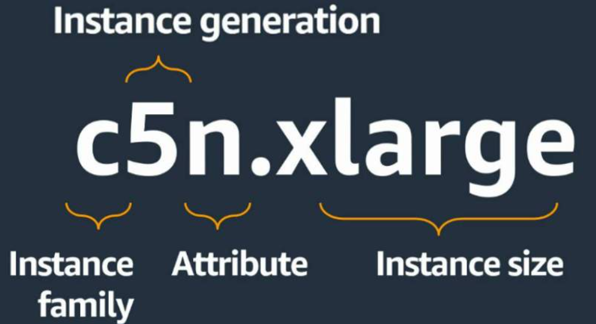
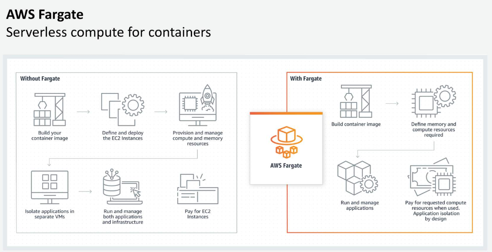
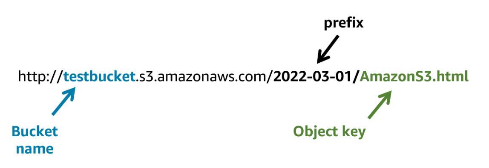
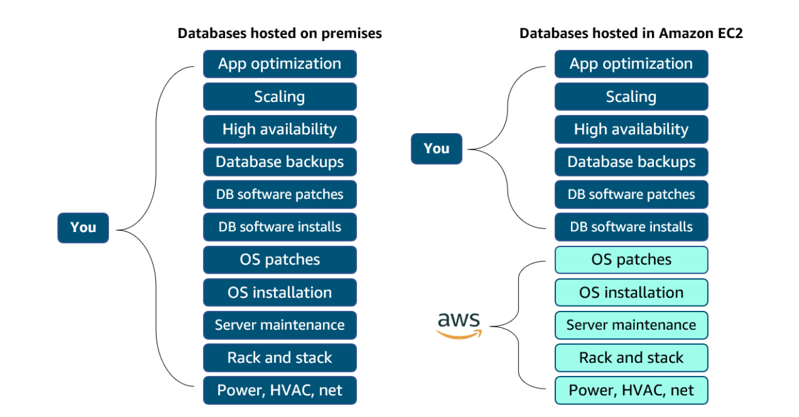
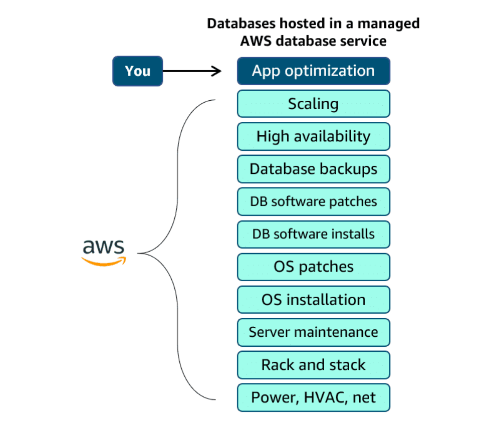
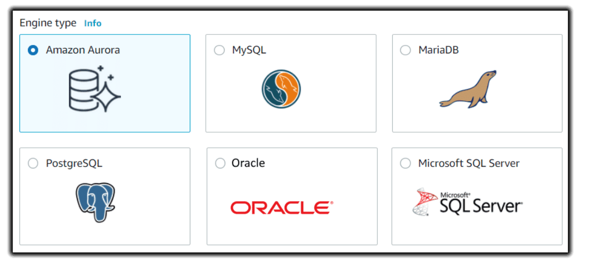
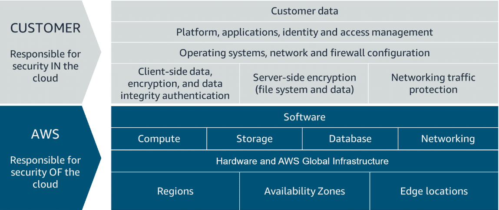

# Terminology
EC2 - Elastic Compute Cloud
AMI - Amazon Machien Image

ECS - Elastic Container Service
EKS - Elastic Kubernetes Service
Fargate - Serverless

Block storage in the cloud is analogous to direct-attached storage (DAS) or a storage area network (SAN).
File storage systems are often supported with a network-attached storage (NAS) server.
EFS - Elastic File System (set-and-forget)
FSx - Managed service
    Lustre
    NetApp ONTAP
    OpenZFS
    Windows File Server
EBS - Elastic Block Storage
S3 - Simple Storage Service
Unmanaged DB 
Manged DB 
RDS - Relational Database Service  (Under the hood it is an EC2 instance with EBS storage, can be configured to be multi AZ redundant)
CloudWatch
ELB - Elastic Load Balancing
# Security
