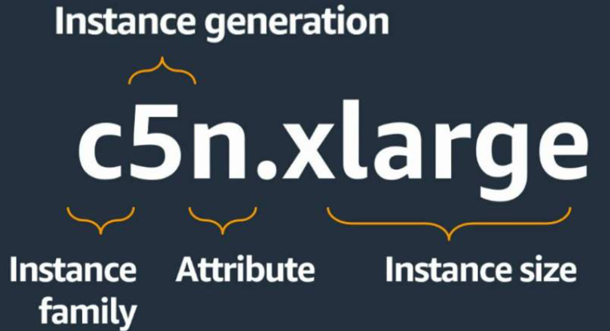
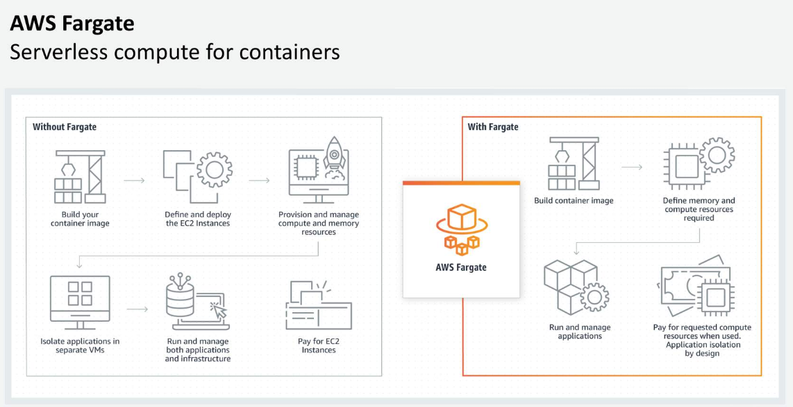
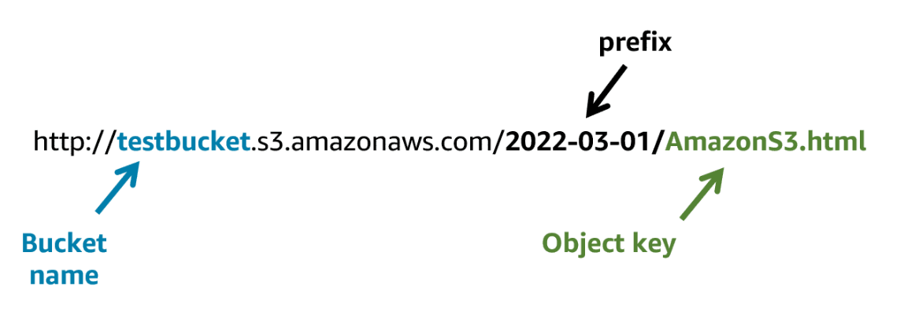
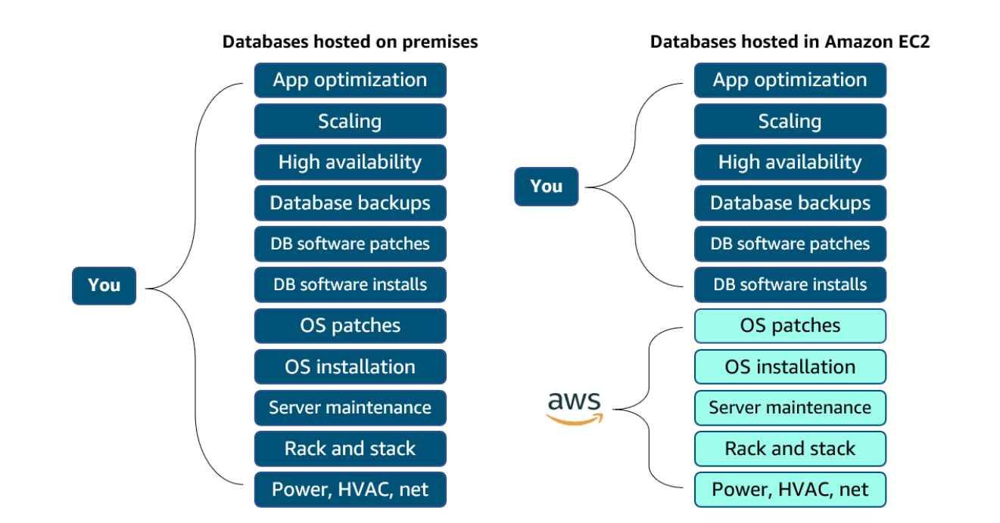
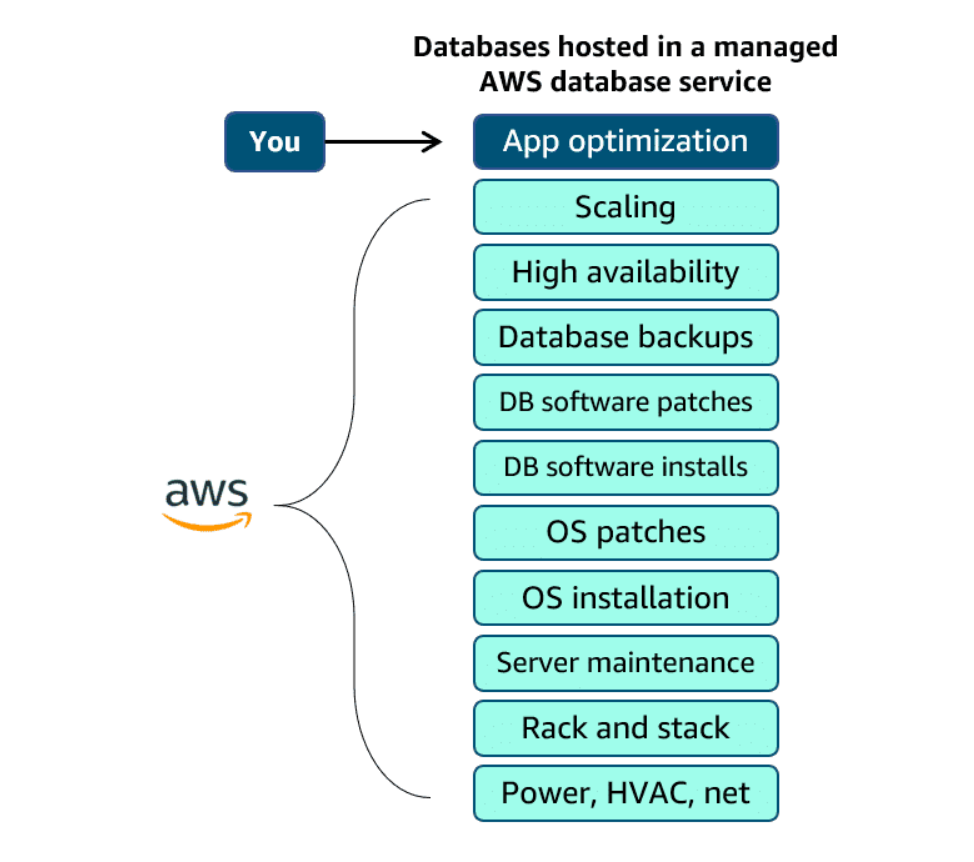
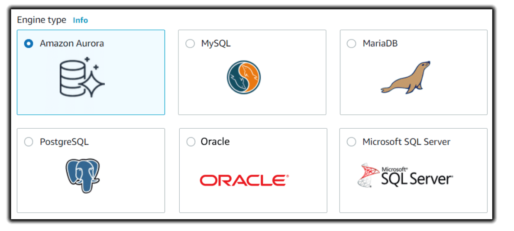
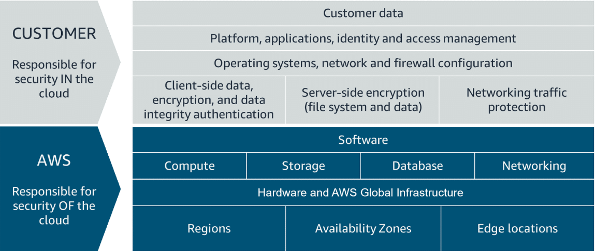

# Terminology
EC2 - Elastic Compute Cloud
AMI - Amazon Machien Image

ECS - Elastic Container Service
EKS - Elastic Kubernetes Service
Fargate - Serverless

Block storage in the cloud is analogous to direct-attached storage (DAS) or a storage area network (SAN).
File storage systems are often supported with a network-attached storage (NAS) server.
EFS - Elastic File System (set-and-forget)
FSx - Managed service
    Lustre
    NetApp ONTAP
    OpenZFS
    Windows File Server
EBS - Elastic Block Storage
S3 - Simple Storage Service
Unmanaged DB 
Manged DB 
RDS - Relational Database Service  (Under the hood it is an EC2 instance with EBS storage, can be configured to be multi AZ redundant)
CloudWatch
ELB - Elastic Load Balancing
# Security

IAM Policies determine what IAM Principals can act out on your account.
In an AWS organization there are AWS accounts. Within these accounts there are IAM Users who are part of IAM Groups and have long-term security credentials that they can use according to the IAM Policies. These policies can also be used to describe IAM Roles to evaluate Temporary Ssecurity Credentials.
IAM users, part of IAM groups with long term security credentials can use those credentials to authenticate to a Security Token Service to assume a Role and get temporary security credentials. 

When talking about VPC security the differences between Security Groups and Network Access Control Lists is important:
| Solution/Description | Security Group | NACL |
| --- | --- | --- |
| Operates at | Instance level | Subnet level |
| Supports | Allow rules only | Allow and Deny rules |
| Traffic | Stateful, return traffic is allowed | Stateless, return traffic must also be specified |
| Rules | Evaluates all rules before deciding on traffic | Evaulates rules in a hierarchical order |
| Instances | Applies only if associated with an instance | Automatically applies to all instances in the subnet associated with it |

Resources inside VPCs (ec2, rds databases, big data, etc.) are protected by Security Groups and NACL while resources outside of VPC (s3, AWS DynamoDB) are protected by  IAM.

Amazon GuardDuty uses the VPC flow logs and DNS logs (Route 53) for network detection and AWS Threat Intel + ML for threat detection.

#CLI
aws iam list-users --> list users in the account
aws iam list-access-key --user-name --> shows access key ID for a specified user
aws iam list-roles --> lists roles in an account
aws organizations describe-organization --> can potentially leak the root email via showing the organization master email
aws iam list-groups --> lists groups
aws iam get-group --group-name --> info about a specified group
aws iam get-policy --policy-arn arn:aws:iam::aws:policy/AdministratorAccess --> (Amazon Ressource Name) policy description:
    1. (Optional) Sid
    2. Action --> "ec2:StopInstance", "s3:GetObject", "sts:AssumeRole", "ima:ListUsers"
    3. Resource --> is in ARS format
    4. Effect --> Allor or Deny
    5. Principal --> For resource based policies only, describes a specific Principal allowed or denied access.
    6. Condition --> Evaluates against specific keys and values in the context of a request (Optional)
aws s3api get-bucket-policy --bucket --> to get policy info of a specified bucket
aws s3 ls *bucketname* --> to list contents of a specified bucket
aws lambda get-policy --function-name *ARM* --query Policy --> to get policy infor of lambda functions ( --output text | jq --> for readabillity)
aws iam create-login-profile --user *username* --password '*password*' --> create user
//sts workflow
aws iam create-user --user-name *username* --> create user
aws iam add-user-to-group --user-name *username* --group-name *groupname* --> add user to group (authorization)
aws iam create-access-key --user-name *username* --> create access key to allow user to authenticate to AWS API (getting aws secret access key and aws access key id)
aws sts get-caller-identity --> whoami
aws sts assume-role --role-arn *arntorole* --role-session-name --> Toassume role you need three things: 1. Permission to assume role which comes from the IAM group. 2. The arn of the role. 3. A role session name for logging and traceability.
aws s3 sync s3://*bucket-name* . --no-sign-request --> to access public buckets //for example: Amazon Machine Images found in public buckets can be re-created with ssh-keys owned by you, providing access
// When attacking ec2 instances remember the Instance Metada Service and it's IP 169.254.169.254. Also SSRF
// Each ec2 instance has at least one Elastic Network Interface attached to it and each of the ENIs are part of at least one security group. Ec2s can act as NAT, firewall or router but then network security feature must be disabled.

